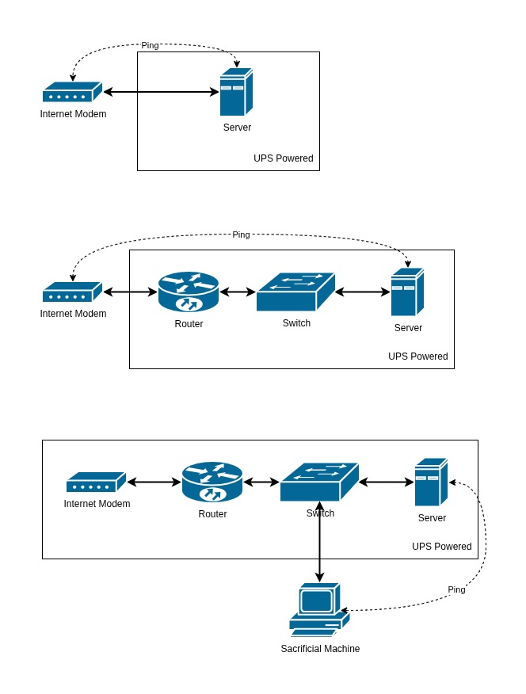

# Auto Shutdown

Monitors network connectivity to a router and automatically shuts down the system after a configurable number of consecutive ping failures. Runs as a systemd service in the background.

## Use Case

Designed for small servers that run on limited or non-standard backup power (e.g. a UPS or small battery). When the network goes down — which typically signals a power outage — the server shuts down gracefully before the backup power runs out, preventing data corruption.

## Sample Infrastructure



> [!NOTE]
> The infrastructure may vary, but the logic remains the same.

## How It Works

1. Pings the specified router IP every `DELAY` seconds
2. Tracks consecutive failures in `DROP_COUNT`
3. When `DROP_COUNT` reaches `DROP_LIMIT`, the system shuts down
4. A successful ping resets `DROP_COUNT` to 0
5. All events are logged to `/var/log/auto-shutdown.log`

## Installation

Run the install script with three arguments:

```bash
sudo bash install.sh <ROUTER-IP> <DELAY-IN-SECONDS> <DROP-LIMIT>
```

**Example** — check every 60 seconds, shut down after 5 consecutive failures:

```bash
sudo bash install.sh 192.168.1.1 60 5
```

The installer will:

- Inject your configuration values into the script
- Move the script to `/usr/local/sbin/auto-shutdown.sh`
- Create and enable the systemd service `autoshutdown.service`

## Managing the Service

```bash
# Check status
sudo systemctl status autoshutdown.service

# Stop the service
sudo systemctl stop autoshutdown.service

# Disable from starting on boot
sudo systemctl disable autoshutdown.service
```

## Logs

```bash
tail -f /var/log/auto-shutdown.log
```

## Requirements

- Ubuntu / Debian-based Linux
- `ping` (from `iputils-ping`)
- `sudo` privileges
